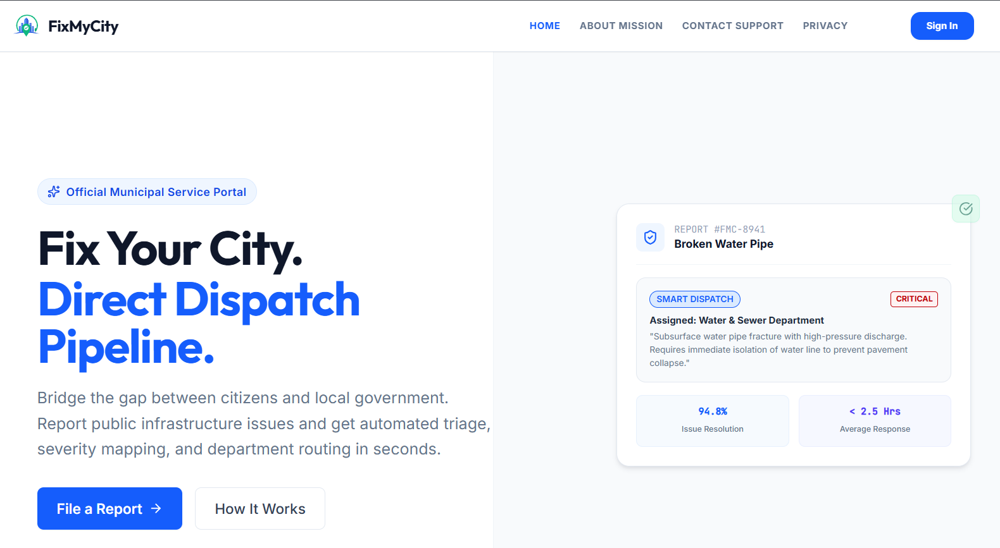
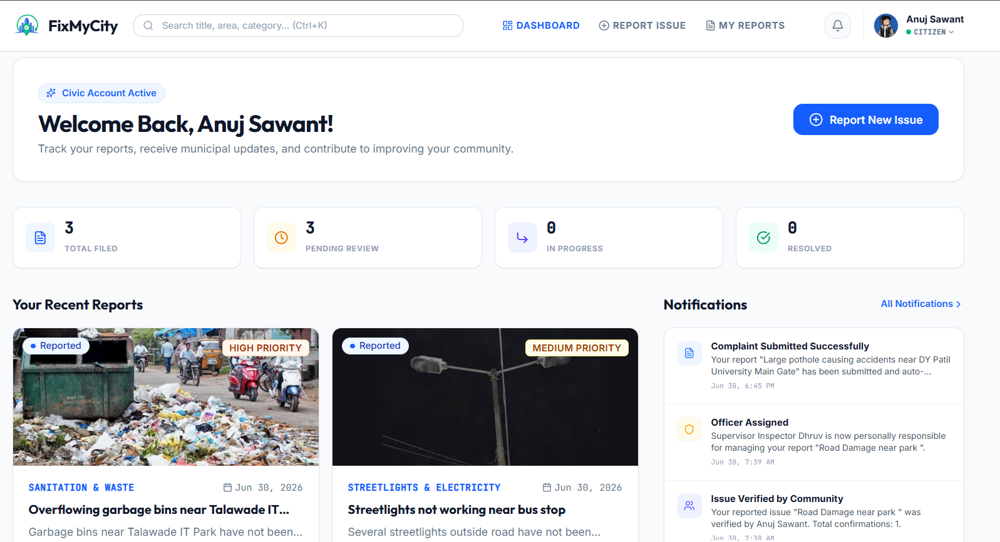
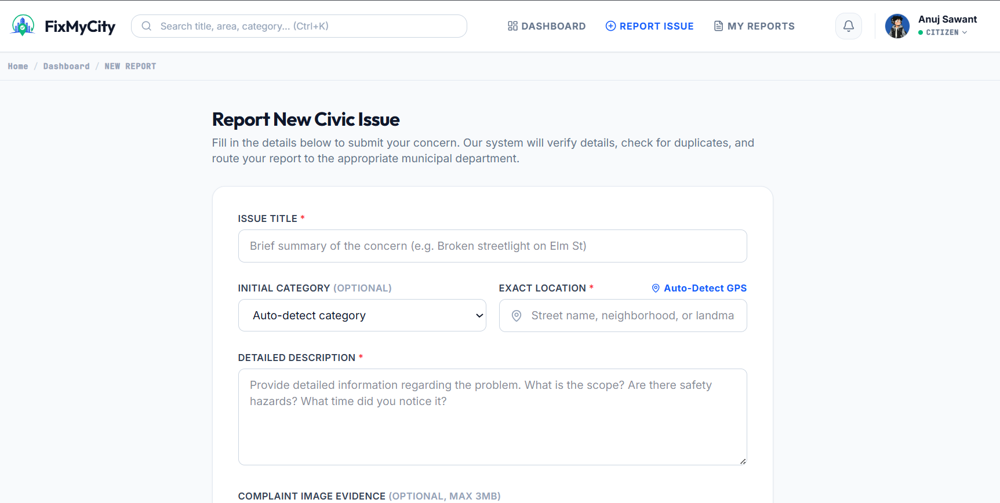
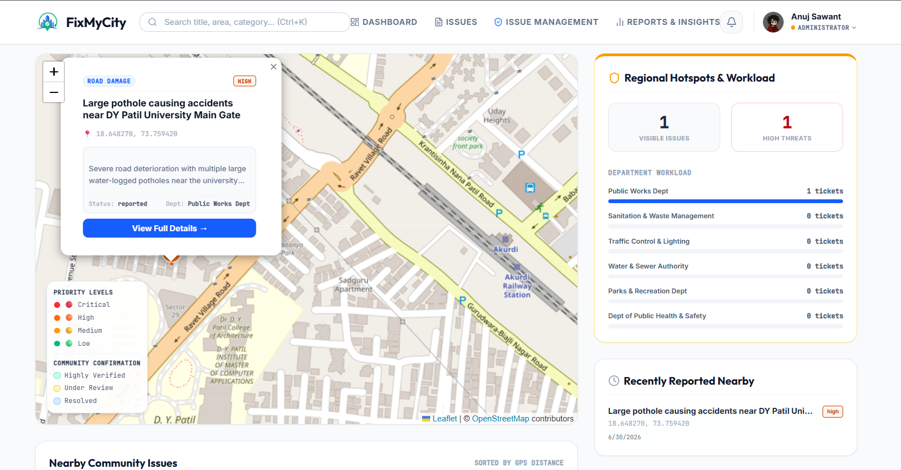
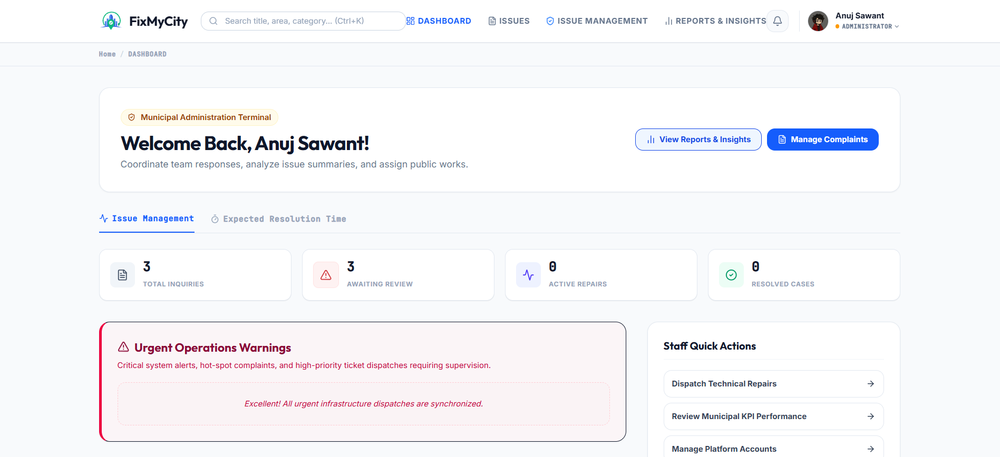
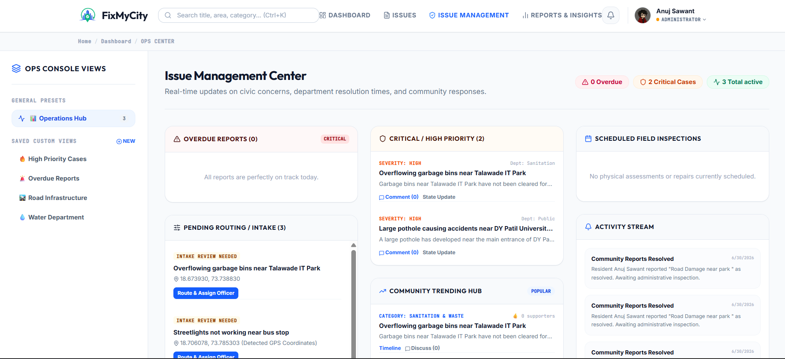
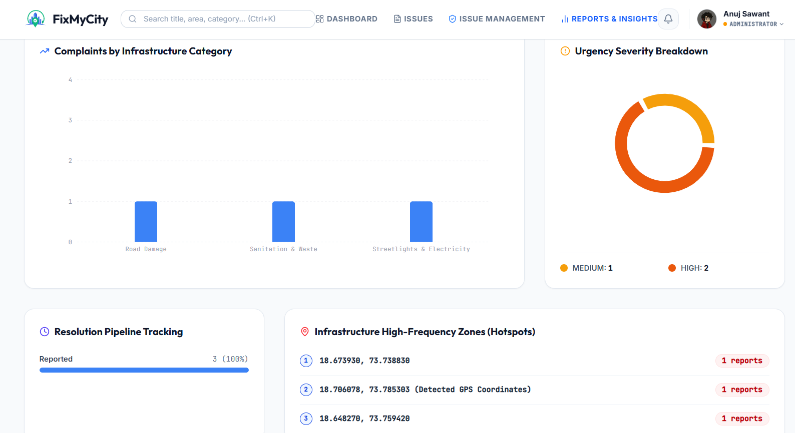

# FixMyCity

## Civic Issue Reporting & Municipal Management Platform

FixMyCity is an civic issue reporting and municipal management platform that enables citizens to report public infrastructure issues while helping municipal authorities efficiently manage, prioritize, and resolve complaints through AI-assisted workflows.

The platform combines Google's AI and cloud technologies to improve transparency, reduce duplicate complaints, streamline municipal operations, and provide citizens with real-time visibility into the status of their reports.

---

## Overview

Urban residents frequently encounter issues such as potholes, water leakages, overflowing garbage bins, broken streetlights, drainage blockages, and damaged public infrastructure. Traditional complaint systems are often slow, fragmented, and lack transparency.

FixMyCity modernizes this process by allowing citizens to securely report issues with supporting images and location data while enabling municipal administrators to verify, assign, monitor, and resolve complaints through a centralized dashboard.

---

# Application Preview

## Landing Page



---

## Citizen Dashboard



---

## Report Issue



---

## Community Map



---

## Administrator Dashboard



---

## Issue Management



---

## Reports & Insights



---

# Features

## Citizen Portal

- Secure Google Sign-In
- AI-assisted issue reporting
- Image upload support
- GPS and manual location selection
- AI-generated issue summaries
- Automatic issue categorization
- Duplicate issue detection
- Community confirmation
- Real-time issue tracking
- Interactive community map
- Personal complaint history
- Notifications

---

## Administrator Portal

- Issue Management Dashboard
- Department assignment
- Officer assignment
- Status management
- Resolution evidence upload
- Reports & Insights
- Global Search
- Operations Center
- Notifications
- Performance monitoring

---

## Google Gemini

Google Gemini is integrated into FixMyCity to enhance the quality and efficiency of civic issue management. By analyzing citizen reports, it helps streamline municipal workflows through:

- Intelligent issue summarization
- Automatic issue categorization
- Severity and priority assessment
- Municipal department recommendation
- Duplicate report identification
- Community insights and trend analysis

---

# System Workflow

```text
Citizen Login
        │
        ▼
Report Issue
        │
        ▼
Upload Image
        │
        ▼
Location Selection
        │
        ▼
AI Analysis
        │
        ▼
Duplicate Detection
        │
        ▼
Submit Report
        │
        ▼
Cloud Firestore
        │
        ▼
Administrator Dashboard
        │
        ▼
Department Assignment
        │
        ▼
Status Updates
        │
        ▼
Issue Resolution
        │
        ▼
Citizen Notification
```

---

# System Architecture

```text
                        Citizens
                            │
                            ▼
              React + TypeScript Frontend
                            │
        ┌───────────────────┼───────────────────┐
        ▼                   ▼                   ▼
 Firebase Authentication  Gemini API   Google Maps APIs
                            │
                            ▼
                    Cloud Firestore
                            │
                            ▼
                Administrator Dashboard
                            │
                            ▼
                    Issue Resolution
```

---

# Technology Stack

| Category | Technology |
|-----------|------------|
| Frontend | React.js, TypeScript, Vite |
| Styling | Tailwind CSS |
| Backend | Node.js, Express.js |
| Database | Cloud Firestore |
| Authentication | Firebase Authentication |
| Artificial Intelligence | Google Gemini API |
| Maps | Google Maps API, Google Places API, Google Geocoding API, Browser Geolocation API |
| Hosting | Firebase Hosting |
| Cloud Services | Firebase Cloud Functions |

---

# Google Technologies Used

| Technology | Purpose |
|------------|---------|
| Google AI Studio | AI-assisted application development |
| Gemini API | Issue analysis, summarization, categorization, and recommendations |
| Firebase Authentication | Secure Google Sign-In |
| Cloud Firestore | Real-time database |
| Firebase Hosting | Web application hosting |
| Firebase Cloud Functions | Background automation and notifications |
| Google Places API | Address autocomplete |
| Google Geocoding API | Address to GPS conversion |
| Browser Geolocation API | Current location detection |

---

# Project Structure

```text
FixMyCity
│
├── src/
│   ├── components/
│   ├── context/
│   ├── hooks/
│   ├── pages/
│   ├── services/
│   ├── types/
│   └── utils/
│
├── functions/
│
├── public/
│
├── docs/
│   └── screenshots/
│
├── firebase.json
├── firestore.rules
├── package.json
└── README.md
```

---

# Installation

Clone the repository.

```bash
git clone https://github.com/YOUR_USERNAME/CommunityHero.git
```

Navigate into the project.

```bash
cd CommunityHero
```

Install dependencies.

```bash
npm install
```

Create a `.env` file.

```env
GEMINI_API_KEY=YOUR_API_KEY
```

Run the development server.

```bash
npm run dev
```

---

# Firebase Configuration

Configure the following Firebase services before running the project.

- Firebase Authentication
- Cloud Firestore
- Firebase Hosting
- Cloud Functions

Update the Firebase configuration with your own project credentials.

---

# Future Enhancements

- Mobile application
- Email notifications
- Push notifications
- Predictive maintenance analytics
- AI-based infrastructure damage detection
- Multilingual support

---

# Project Impact

FixMyCity improves communication between citizens and municipal authorities by providing an intelligent, transparent, and collaborative platform for reporting and managing civic issues.

The platform reduces duplicate reports, improves operational efficiency, supports informed decision-making through AI-assisted analysis, and enables citizens to monitor the complete lifecycle of their complaints in real time.

---
